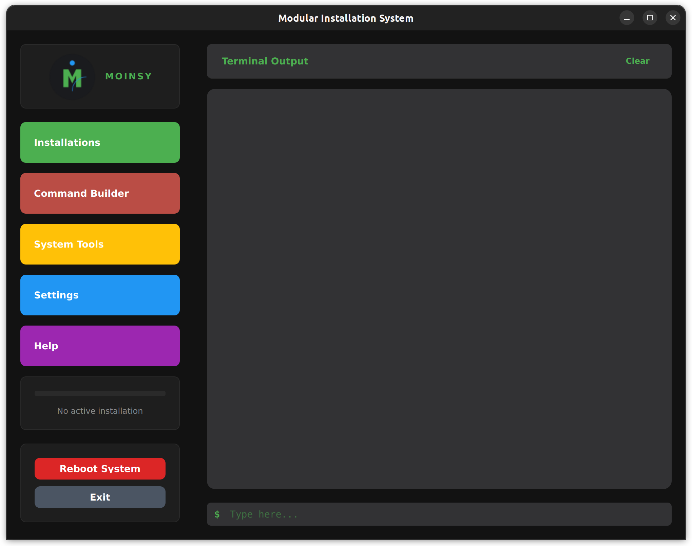
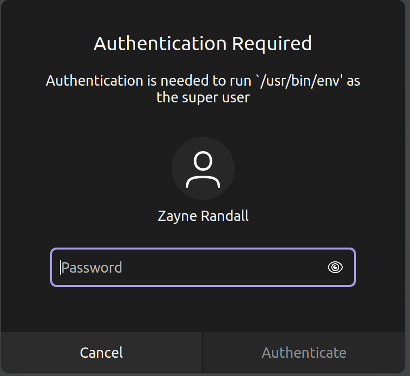
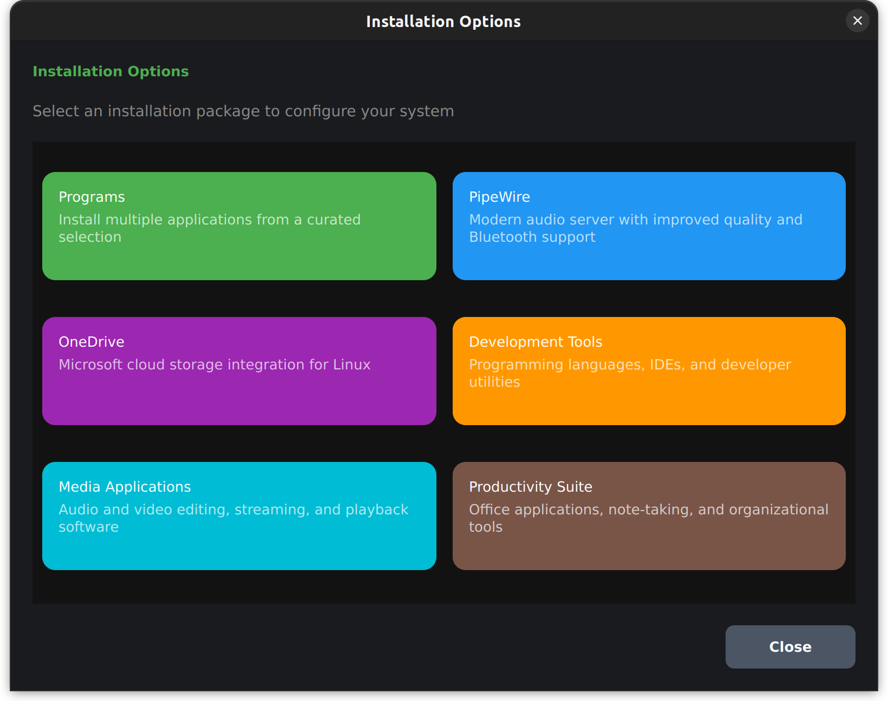
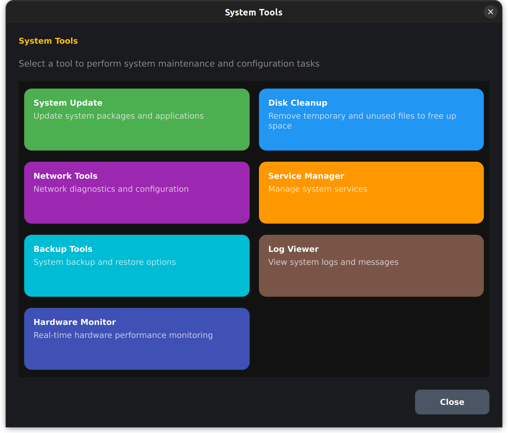
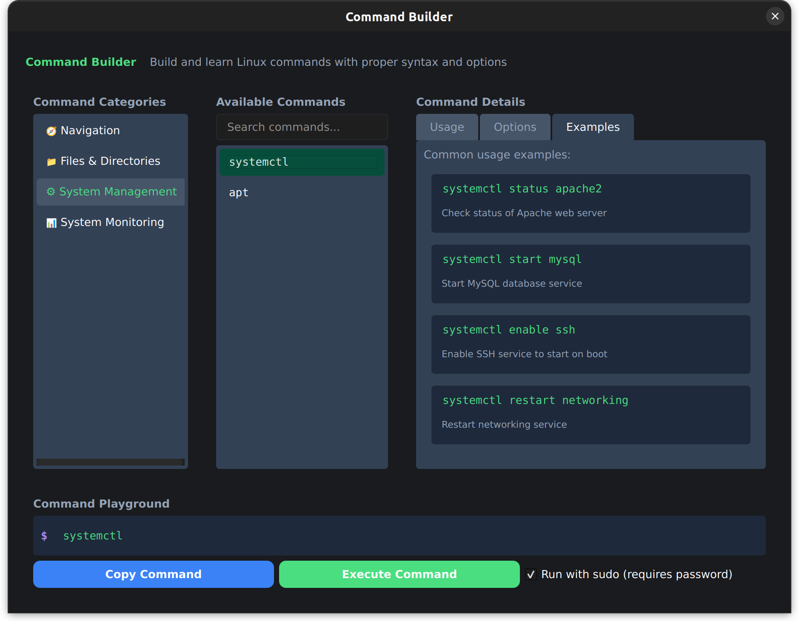

# Moinsy - Modular Installation System



Moinsy is a modern, modular installation and system management utility for Linux. It provides a clean, intuitive interface for common system tasks, software installation, and configuration management in a unified dashboard.

## Features

### Installation Management
- **Multi-Source Software Installation**: Install multiple applications and packages from apt, flatpak, and snap repositories in bulk
- **PipeWire Audio Setup**: Easily install and configure the modern PipeWire audio server with improved sound quality and Bluetooth support
- **OneDrive Integration**: Set up Microsoft OneDrive synchronization on your Linux system

### System Tools
- **System Updater**: Keep your system and applications up-to-date across all package managers
- **Service Manager**: Control and configure system services with an intuitive interface
- **Hardware Monitor**: Track system performance metrics in real-time (CPU, memory, storage, GPU)
- **Command Builder**: Learn and create Linux commands with proper syntax and options
- **Disk Cleanup**: Remove unnecessary files to free up storage space (coming soon)
- **Network Tools**: Network diagnostics and configuration tools (coming soon)

### User Interface
- **Terminal Output**: View command execution progress with colored output
- **Progress Tracking**: Visual progress indicators for installation operations
- **Dark Theme**: Eye-friendly interface designed for extended usage
- **Comprehensive Help**: Built-in documentation for all features

## Screenshots



Moinsy uses a PolKit authentication policy to borrow your password from the system securely until the application is closed.

## Requirements

- A Debian-based Linux distribution (Ubuntu, Linux Mint, etc.)
- Python 3.8 or newer
- Administrative (sudo) privileges
- Minimum system requirements:
  - 2GB RAM
  - 300MB free disk space
  - 1024x768 screen resolution

## Installation

### 1. Clone the repository

```bash
cd ~/Downloads
git clone https://github.com/femdres/moinsy.git
cd moinsy
```

### 2. Run the installer script

```bash
chmod +x configure.sh
./configure.sh
```

The installer will:
- Move the application to `/opt/moinsy`
- Create a desktop launcher
- Set up the required Python environment
- Configure necessary permissions

### 3. Restart your system

After installation completes, reboot your system to ensure all components are properly initialized.

## Usage

### Starting Moinsy

You can start Moinsy from your application menu or by running:

```bash
/opt/moinsy/run-moinsy.sh
```

### Main Features

#### Software Installation



1. Click the "Installations" button in the sidebar
2. Select from available installation options:
   - **Programs**: Install multiple applications from a curated list
   - **PipeWire**: Set up the modern PipeWire audio server
   - **OneDrive**: Configure Microsoft OneDrive integration
   - **Development Tools**: Set up programming environments
   - **Media Applications**: Install audio/video software
   - **Productivity Suite**: Set up office and organizational tools

#### System Tools



1. Click the "System Tools" button in the sidebar
2. Select a tool to use:
   - **System Update**: Update your system packages and applications
   - **Service Manager**: Control system services
   - **Hardware Monitor**: Track system performance in real-time
   - **Disk Cleanup**: Remove unnecessary files (coming soon)
   - **Network Tools**: Diagnose and configure network settings (coming soon)

#### Command Builder



The Command Builder helps you learn and create Linux command sequences with proper syntax and options. It includes:
- Command categories organized by function
- Detailed descriptions of command options
- Interactive command creation with syntax highlighting
- Usage examples for common tasks

#### Settings

Configure Moinsy's appearance and behavior through the Settings panel, including:
- Window size and display options
- Terminal preferences
- System integration options
- Update behaviors

## Development

### Setting Up Development Environment

1. Clone the repository to the installation location:
   ```bash
   sudo mkdir -p /opt/moinsy
   sudo chown $USER:$USER /opt/moinsy
   git clone https://github.com/femdres/moinsy.git /opt/moinsy
   cd /opt/moinsy
   ```

2. Run the development configuration script:
   ```bash
   chmod +x dev_configure.sh
   ./dev_configure.sh --dev-deps
   ```

3. For direct development without installation:
   ```bash
   python3 -m venv venv
   source venv/bin/activate
   pip install -r requirements.py
   cd src
   python3 moinsy.py
   ```

Note: Some features requiring system privileges may not work correctly without running as root.

## Troubleshooting

### Common Issues

1. **Installation fails with permission error**
   - Ensure you're running the configure script with sudo privileges
   - Check if /opt directory is writeable

2. **PipeWire installation doesn't work**
   - Ensure your system is compatible with PipeWire
   - Check system logs for specific errors

3. **GUI appears without styling**
   - Ensure PyQt6 is properly installed
   - Check if theme files are accessible

### Generating Logs

To generate detailed logs for troubleshooting:

```bash
/opt/moinsy/run-moinsy.sh --debug > moinsy-debug.log 2>&1
```

## Contributing

Contributions are welcome! Please feel free to submit a Pull Request.

1. Fork the repository
2. Create your feature branch (`git checkout -b feature/amazing-feature`)
3. Commit your changes (`git commit -m 'Add some amazing feature'`)
4. Push to the branch (`git push origin feature/amazing-feature`)
5. Open a Pull Request

## License

This project is licensed under the GNU General Public License v3.0 - see the LICENSE file for details.

## Acknowledgments

- Created by femdres
- Inspired by the need for simplified system management on Linux
