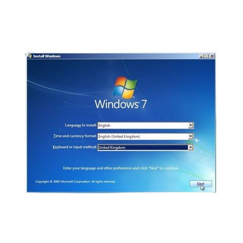

# Moinsy - Modular Installation System



Moinsy is a modern, modular installation and system management utility for Linux. It provides a clean, intuitive interface for common system tasks, software installation, and configuration management in a unified dashboard.

## Features

- **Modular Installation System**: Install curated software packages and configurations with a few clicks
- **PipeWire Audio Setup**: Easily install and configure the modern PipeWire audio server
- **Cloud Storage Integration**: Set up OneDrive synchronization on your Linux system
- **System Tools**: 
  - System Update utility for keeping your system up-to-date
  - Service Manager for controlling system services
  - Hardware Monitor for real-time performance tracking
  - Command Builder for learning and using Linux commands

## Screenshots

## Requirements

- A Debian-based Linux distribution (Ubuntu, Linux Mint, etc.)
- Python 3.8 or newer
- Administrative (sudo) privileges

## Installation

### 1. Clone the repository

```bash
cd ~/Downloads
git clone https://github.com/femdres/moinsy.git
cd moinsy
```

### 2. Run the installer script


```bash
chmod +x configure.sh
./configure.sh
```

The installer will:
- Move the application to `/opt/moinsy`
- Create a desktop launcher
- Set up the required Python environment
- Configure necessary permissions

### 3. Restart your system

After installation completes, reboot your system to ensure all components are properly initialized.

## Usage

### Starting Moinsy

You can start Moinsy from your application menu or by running:

```bash
/opt/moinsy/run-moinsy.sh
```

### Main Features

#### Software Installation

1. Click the "Installations" button in the sidebar
2. Select from available installation options:
   - Programs: Install multiple applications from a curated list
   - PipeWire: Set up the modern PipeWire audio server
   - OneDrive: Configure Microsoft OneDrive integration
   - Development Tools: Set up programming environments
   - Media Applications: Install audio/video software
   - Productivity Suite: Set up office and organizational tools

#### System Tools

1. Click the "System Tools" button in the sidebar
2. Select a tool to use:
   - System Update: Update your system packages and applications
   - Service Manager: Control system services
   - Hardware Monitor: Track system performance in real-time
   - Disk Cleanup: Remove unnecessary files (coming soon)
   - Network Tools: Diagnose and configure network settings (coming soon)

#### Command Builder

The Command Builder helps you learn and create Linux command sequences with proper syntax and options. It includes:
- Command categories organized by function
- Detailed descriptions of command options
- Interactive command creation with syntax highlighting
- Usage examples for common tasks

#### Settings

Configure Moinsy's appearance and behavior through the Settings panel, including:
- Dark/Light theme options
- Terminal preferences
- Window sizing
- System integration options

## Development

### Setting Up Development Environment

1. Clone the repository:
   ```bash
   git clone https://github.com/femdres/moinsy.git
   cd moinsy
   ```

2. Create a Python virtual environment:
   ```bash
   python3 -m venv venv
   source venv/bin/activate
   ```

3. Install dependencies:
   ```bash
   pip install -r src/requirements.py
   ```

### Running in Development Mode

For development, you can run Moinsy directly from the source:

```bash
cd src
python3 moinsy.py
```

Note: Some features requiring system privileges may not work correctly without running as root.

## Contributing

Contributions are welcome! Please feel free to submit a Pull Request.

1. Fork the repository
2. Create your feature branch (`git checkout -b feature/amazing-feature`)
3. Commit your changes (`git commit -m 'Add some amazing feature'`)
4. Push to the branch (`git push origin feature/amazing-feature`)
5. Open a Pull Request

## License

This project is licensed under the GNU General Public License v3.0 - see the LICENSE file for details.

## Acknowledgments

- Created by femdres
- Thanks to the PyQt6 project for the GUI framework
- Inspired by the need for simplified system management on Linux
